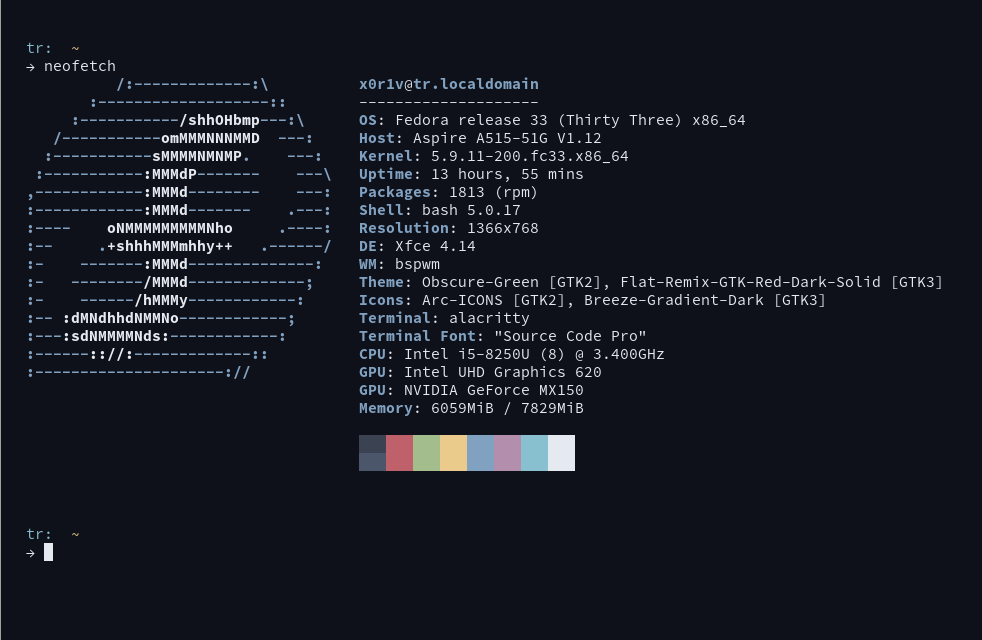

### Installation:

- clone this repo
- copy the `alacritty.yml` file to `~/.config/alacritty` folder

### Screenshot:

### License:

Licensed Under The GNU GPL version 3, For more info read [LICENSE](./LICENSE).
