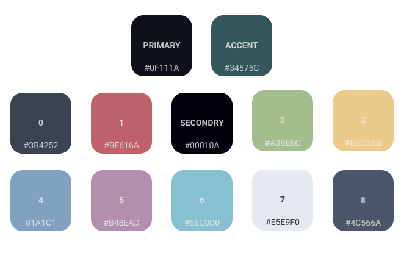

  

### Introduction

This is my own effort to create a color scheme that doesn't blind by being too
dark or too light and not solarized. I found this color (`0f111a`) for the first
time on material theme for Vscode, so i copied the main color and added other
colors gradually until here we are, currently anything that uses Xresources can
use these colors, and there are many other apps themed as well.

### Desktop Environments

- [GTK Based Theme](https://github.com/material-ocean/Gtk-Theme)
- [QT Based Theme](https://github.com/material-ocean/plasma)

### Applications

- [Termite](https://github.com/material-ocean/Termite-theme)
- [Plank](https://github.com/material-ocean/Plank-Theme)
- [Rofi](https://github.com/material-ocean/rofi-Theme)
- [Spotify](https://github.com/material-ocean/Spotify-Theme)
- [Swift Installer](https://github.com/material-ocean/Android-Theme)
- [Telegram](https://github.com/material-ocean/Telegram-Theme)
- [InkDrop](https://github.com/material-ocean/inkdrop-ui)
- [Typora](https://github.com/material-ocean/Typora-Theme)
- [Google Keyboard](https://github.com/AkosPaha/Material-ocean-gboard-theme)
- [Firefox](https://github.com/material-ocean/Firefox-Theme)
- [Notion](https://github.com/material-ocean/Notion-Theme)
- [Termux](https://github.com/material-ocean/Termux-Theme)
- [Kitty](https://github.com/material-ocean/Kitty-theme)
- [Alacritty](https://github.com/material-ocean/Alacritty-theme)

### From 3rd party

- [Vim](https://github.com/hzchirs/vim-material)
- [VScode](https://marketplace.visualstudio.com/items?itemName=Equinusocio.vsc-material-theme)
- [Intellij](https://plugins.jetbrains.com/plugin/8006-material-theme-ui)

### Custom ROMs

- [LegionOS](https://github.com/legionRom)
- [CorvusOS](https://corvus-rom.github.io/)
- [MSM-Xtended](https://msmxtended.me/)
- [Resurrection Remix](https://github.com/ResurrectionRemix/)
- [Fluid OS](http://fluidos.me)

### Websites

- [Jekyll website template](https://github.com/Blacksuan19/blacksuan19.github.io)
- [blacksuan19.tk](https://blacksuan19.tk)
- [prateekpunetha.dev](https://prateekpunetha.dev/)
- [akospaha.tk](https://akospaha.tk/)

### Notes

- To be able to use the colors globally copy `.Xresources` to `~/.Xresources`
- for more applications check out
  [my dotfiles](https://github.com/Blacksuan19/Dotfiles)

### Installation

- Each repo has specific instructions on how to install

### Colors

### Contributions

- If you have created a theme for an application do a pull request here adding
  it to the list, then I will fork the repo.

### License

Licensed Under The GNU GPL version 3, For more info read [LICENSE](./LICENSE).
